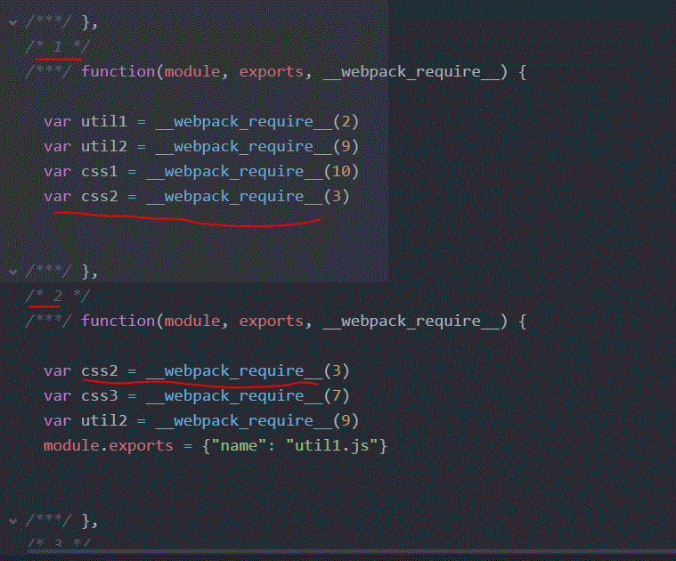
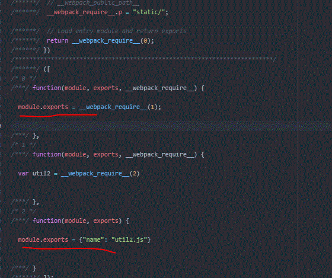
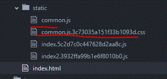

## webpack打包原理解析

一开始，对webpack打包原理很不熟悉，看了不少资料，但是讲的都不是很清楚，现在来梳理一遍。

## 所有资源统一入口

这个是什么意思呢？就是webpack是通过js来获取和操作其他文件资源的，比如webpack想处理less,
但是它并不会直接从本地的文件夹中直接通过路径去读取css文件，而且通过执行入口js文件，如果入口
文件中，或者入口文件相关联的js文件中含有 require(xx.less) 这个less文件，那么它就会通过
对应的loader去处理这个less文件

## 打包中的文件管理

重点来了: webpack是如何进行资源的打包的呢？

总结:

- **每个文件都是一个资源，可以用require导入js**
- **每个入口文件会把自己所依赖(即require)的资源全部打包在一起，一个资源多次引用的话，只会打包一份**
- **对于多个入口的情况，其实就是分别独立的执行单个入口情况，每个入口文件不相干(可用CommonsChunkPlugin优化)**


## js单文件入口的情况


比如整个应用的入口为 entry.js

entry.js引用 util1.js util2.js， 同时util1.js又引用了util2.js

>关键问题是: 它打包的会不会将 util2.js打包两份？

其实不会的，webpack打包的原理为，在入口文件中，对每个require资源文件进行配置一个id, 也
就是说，对于同一个资源,就算是require多次的话，它的id也是一样的，所以无论在多少个文件中
require，它都只会打包一分

对于和上面一致拓扑图，打包后的js代码为


>注:  ```/* 1 */``` 代码打包模块为 id 为 1

通过上面的图片我们看到，
- entry.js 入口文件对应的id为 1
- util1.js的id为 2
-  util2.js的id为 3

entry.js引用了 2 和 3, util1.js引用了 3，说明了entry和util1引用的是同一份，util2.js不会重复打包

## css单文件入口的情况

上面分析了js的情况，其实css也是一个道理。它同样也会为每个css资源分配一个id, 每个资源同样也只会导入一次。


可以看到, entry.js 和 util1.js共同引用了 style2.less，那么它们作用的结果是怎么样的呢？



可以看到 entry.js 和 util1.js使用的是同一个 css资源

注意: ```/* 1 */``` 注释表示id为1的模块

听说 ExtractTextPlugin 导出css的插件比较火， 让我们来看看它到底帮我们干了啥？配置好相关引用后
```js
newExtractTextPlugin('[name].[chunkhash].css')
```
运行，在static下面生成了 一个.css 一个.js

生成的css代码为
```css
.style2 {
  color: green;
}
.style3 {
  color: blue;
}
.style1 {
  color: red;
}
```
实际就是把三个css导出到一个css文件，而且同一个入口中，多次引用同一个css，实际只会打包一份

生成的.js为


可以看到 ```/* 2 */``` 实际就是 util1.js模块，还是引用 id为3的模块 即css2, 但是我们看 3 模块
的定义，为空函数， 它给出的解释是  ```removed by extract-text-webpack-plugin``` 实际
就是newExtractTextPlugin把相关的css全部移出去了


## 多文件入口的情况

讲完了单入口，还需讲讲多入口，很多时候我们项目是需要多入口


修改webpack config


可以看到 输出为两个js文件

先对 entry.js 对应的输出文件进行分析


其实可以看到， util1.js  util2.js的内容都打包进 对应的js里面去了

在对 entry2.js 输出的文件进行分析



可以看到，把entry2.js依赖的 util2.js也打包进去了

**所以多 入口 实际就是 分别执行多个单入口，彼此之间不影响**

问题来了，多入口对应的css呢？ 还是上面的原则，css也是分别打包的，对于每个入口所依赖的css全部打包，
输出就是这个入口对应的css

### 最后讨论 CommonsChunkPlugin

之前提到过，每个入口文件，都会独立打包自己依赖的模块，那就会造成很多重复打包的模块，有没有一种方法
能把多个入口文件中，共同依赖的部分给独立出来呢？ 肯定是有的 CommonsChunkPlugin

这个插件使用非常简单，它原理就是把多个入口共同的依赖都给定义成 **一个新入口**

> 为何我这里说是定义成新入口呢，因为这个名字不仅仅对应着js 而且对于着和它相关的css等，比如
HtmlWebpackPlugin 中 就能体现出来，可以它的 chunks中 加入 common 新入口，它会自动把common
的css也导入html



可以看到， 不仅仅js公共模块独立出来，连css同样也是，感受到了 webpack强大了吧

我们可以大概对 common.js  index.xxxxx.js(entry.js对应的代码) index2.xxxx.js(entry2.js对应的代码)
 打包出来的代码分析一下

**提前知识:**

webpack的id 有两种 一种为 chunkid 一种为moduleId

- 每个chunkid 对应的是一个js文件
- 每个moduleid对应的是一个个js文件的内容的模块（一个js文件里面可以require多个资源，每
个资源分配一个moduleid）

为何要出来一个chunkid呢？ 这个chunkid的作用就是，标记这个js文件是否已经加载过了

```js
/******/ 	// object to store loaded and loading chunks
/******/ 	// "0" means "already loaded"
/******/ 	// Array means "loading", array contains callbacks
/******/ 	var installedChunks = {
/******/ 		2:0
/******/ 	};
```

installedChunks 是记录一个chunkid是否已经加载过了


我们先从 common.js分析

common.js是公共分离出来的模块，所以按理来说，它应该是一个顶层的模块，实际上，确实如此

看 common.js代码
```js
/******/ (function(modules) { // webpackBootstrap
/******/ 	// install a JSONP callback for chunk loading


/******/ 	var parentJsonpFunction = window["webpackJsonp"];
/******/ 	window["webpackJsonp"] = function webpackJsonpCallback(chunkIds, moreModules) {
/******/ 		// add "moreModules" to the modules object,
/******/ 		// then flag all "chunkIds" as loaded and fire callback
```

定义了一个 webpackJsonp 函数


看 index.xxxx.js代码

```js
webpackJsonp([0],[
/* 0 */
/***/ function(module, exports, __webpack_require__) {

	module.exports = __webpack_require__(1);

/***/ },
```
使用 common.js中定义的函数 webpackJsonp， **所以在浏览器中加载的话，必须先加载 common.js**

这个 webpackJsonp([0],[]) 第一个参数 [0] 是什么意思呢？  它就是 chunkid ,我们知道一个chunkid
id对应一个 js 文件，它对应的js文件就是它的入口文件 entry.js， 那为何这里还要是一个数组

因为一个入口文件的话，可以依赖多个js文件，其他的 id 就是它所依赖的， 其实就是配置webpack的时候

那个入口js对应的 数组

```index: ['./src/js/entry.js'],```   [0] 和 现在的id数组一一对应


在 index2.xxx.js中，

```js

webpackJsonp([1],{

/***/ 0:
/***/ function(module, exports, __webpack_require__) {

	module.exports = __webpack_require__(8);
```

[1] 就是  webpack.config配置的数组 js 对应的 thunkid

```index2: ['./src/js/entry2.js']```

即 entry2.js 就是 thunkid 1


上面说完了thunkid, 下面就说 moduleid了， common.js为顶层js文件，通过调用webpackJsonp
对其他文件进行处理，

common.js中
```js
/******/ 	var parentJsonpFunction = window["webpackJsonp"];
/******/ 	window["webpackJsonp"] = function webpackJsonpCallback(chunkIds, moreModules) {
/******/ 		// add "moreModules" to the modules object,
/******/ 		// then flag all "chunkIds" as loaded and fire callback

/******/ 		for(moduleId in moreModules) {

/******/ 			modules[moduleId] = moreModules[moduleId];
/******/ 		}
```

```webpackJsonpCallback(chunkIds, moreModules)```定义为 chunkIds, moreModules，chunkIds 说了，
就是入口文件对应的 js 文件的 thunkid, 那么这个moreModules是什么呢？ 就是一个js文件中，一个个依赖的
和 导出本身的 module

可以看index2.xxxx.js
```js

webpackJsonp([1],{

/***/ 0:
/***/ function(module, exports, __webpack_require__) {

	module.exports = __webpack_require__(8);


/***/ },

/***/ 8:
/***/ function(module, exports, __webpack_require__) {

	var util2 = __webpack_require__(3)
	var css1 = __webpack_require__(4)


/***/ }

});
```

这里 moreModules 为一个对象，key 为 moduleid, value 就是一个个 module定义

比如 ```function(module, exports, __webpack_require__) { module.exports = __webpack_require__(8);}```


最重要的来了， 这里的话， utils2 是公共的module，它被定义在commong.js中，

common.js
```js

/* 0 */,
/* 1 */,
/* 2 */,
/* 3 */
/***/ function(module, exports) {

	module.exports = {"name": "util2.js"}


/***/ },
/* 4 */
```

可以看到， index.xxx.js 的 调用 和 index2.xxx.js的调用都是一样的，都是下面这句

```var util2 = __webpack_require__(3)```

它会寻找 moduleid 为3的模块，然后返回


如何寻找呢 看看 __webpack_require__ 定义

```js
/******/ 	function __webpack_require__(moduleId) {

/******/ 		// Check if module is in cache
/******/ 		if(installedModules[moduleId])
/******/ 			return installedModules[moduleId].exports;

/******/ 		// Create a new module (and put it into the cache)
/******/ 		var module = installedModules[moduleId] = {
/******/ 			exports: {},
/******/ 			id: moduleId,
/******/ 			loaded: false
/******/ 		};
```

**if(installedModules[moduleId])**  如果缓存中存在的话，就直接返回。

由于 index.xxx.js 和 index2.xxx.js都是返回的同一个 id 的模块，所以实际上 **它们使用的是同一个对象**

这和nodejs里面的require是一样的，所以整个项目中，**require公共模块中的资源的话，实际返回的都是同一个对象**
