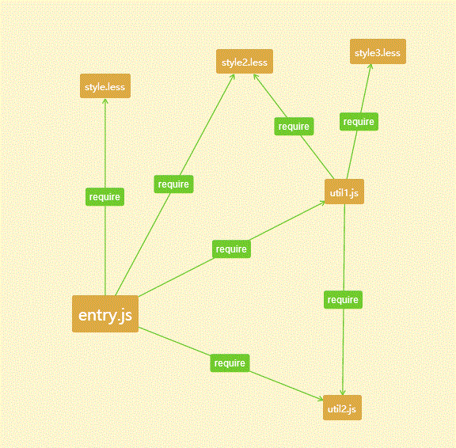
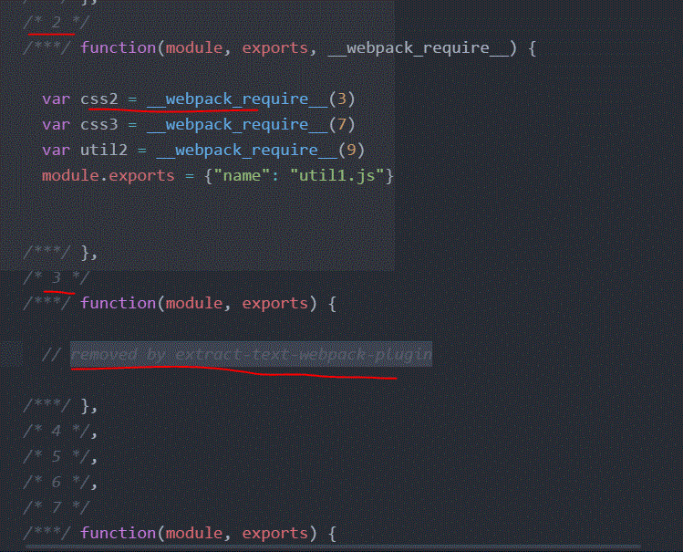
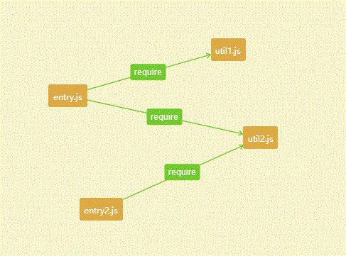
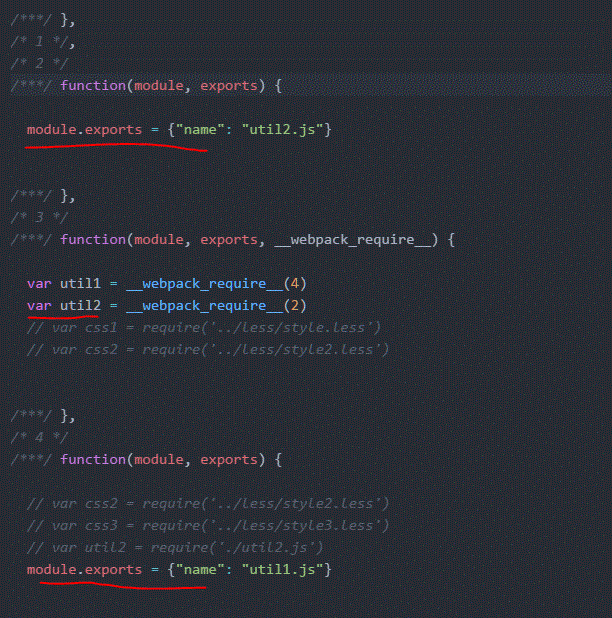

## webpack打包原理解析

一开始，对webpack打包原理很不熟悉，看了不少资料，但是讲的都不是很清楚，现在来梳理一遍。

## 所有资源统一入口

这个是什么意思呢？就是webpack是通过js来获取和操作其他文件资源的，比如webpack想处理less,
但是它并不会直接从本地的文件夹中直接通过路径去读取css文件，而且通过执行入口js文件，如果入口
文件中，或者入口文件相关联的js文件中含有 require(xx.less) 这个less文件，那么它就会通过
对应的loader去处理这个less文件

## 打包中的文件管理

重点来了: webpack是如何进行资源的打包的呢？

总结:

- **每个文件都是一个资源，可以用require导入js**
- **每个入口文件会把自己所依赖(即require)的资源全部打包在一起，一个资源多次引用的话，只会打包一份**
- **对于多个入口的情况，其实就是分别独立的执行单个入口情况，每个入口文件不相干(可用CommonsChunkPlugin优化)**


## js单文件入口的情况


比如整个应用的入口为 entry.js

entry.js引用 util1.js util2.js， 同时util1.js又引用了util2.js

>关键问题是: 它打包的会不会将 util2.js打包两份？

其实不会的，webpack打包的原理为，在入口文件中，对每个require资源文件进行配置一个id, 也
就是说，对于同一个资源,就算是require多次的话，它的id也是一样的，所以无论在多少个文件中
require，它都只会打包一分

对于和上面一致拓扑图，打包后的js代码为


>注:  ```/* 1 */``` 代码打包模块为 id 为 1

通过上面的图片我们看到，
- entry.js 入口文件对应的id为 1
- util1.js的id为 2
-  util2.js的id为 3

entry.js引用了 2 和 3, util1.js引用了 3，说明了entry和util1引用的是同一份，util2.js不会重复打包

## css单文件入口的情况

上面分析了js的情况，其实css也是一个道理。它同样也会为每个css资源分配一个id, 每个资源同样也只会导入一次。



可以看到, entry.js 和 util1.js共同引用了 style2.less，那么它们作用的结果是怎么样的呢？


可以看到 entry.js 和 util1.js使用的是同一个 css资源

注意: ```/* 1 */``` 注释表示id为1的模块

听说 ExtractTextPlugin 导出css的插件比较火， 让我们来看看它到底帮我们干了啥？配置好相关引用后
```js
newExtractTextPlugin('[name].[chunkhash].css')
```
运行，在static下面生成了 一个.css 一个.js

生成的css代码为
```css
.style2 {
  color: green;
}
.style3 {
  color: blue;
}
.style1 {
  color: red;
}
```
实际就是把三个css导出到一个css文件，而且同一个入口中，多次引用同一个css，实际只会打包一份

生成的.js为



可以看到 ```/* 2 */``` 实际就是 util1.js模块，还是引用 id为3的模块 即css2, 但是我们看 3 模块
的定义，为空函数， 它给出的解释是  ```removed by extract-text-webpack-plugin``` 实际
就是newExtractTextPlugin把相关的css全部移出去了


## 多文件入口的情况

讲完了单入口，还需讲讲多入口，很多时候我们项目是需要多入口



修改webpack config


可以看到 输出为两个js文件

先对 entry.js 对应的输出文件进行分析



其实可以看到， util1.js  util2.js的内容都打包进 对应的js里面去了

在对 entry2.js 输出的文件进行分析


可以看到，把entry2.js依赖的 util2.js也打包进去了

**所以多 入口 实际就是 分别执行多个单入口，彼此之间不影响**

问题来了，多入口对应的css呢？ 还是上面的原则，css也是分别打包的，对于每个入口所依赖的css全部打包，
输出就是这个入口对应的css

### 最后讨论 CommonsChunkPlugin

之前提到过，每个入口文件，都会独立打包自己依赖的模块，那就会造成很多重复打包的模块，有没有一种方法
能把多个入口文件中，共同依赖的部分给独立出来呢？ 肯定是有的 CommonsChunkPlugin

这个插件使用非常简单，它原理就是把多个入口共同的依赖都给定义成 **一个新入口**

> 为何我这里说是定义成新入口呢，因为这个名字不仅仅对应着js 而且对于着和它相关的css等，比如
HtmlWebpackPlugin 中 就能体现出来，可以它的 chunks中 加入 common 新入口，它会自动把common
的css也导入html


可以看到， 不仅仅js公共模块独立出来，连css同样也是，感受到了 webpack强大了吧

我们可以大概对 common.js  index.xxxxx.js(entry.js对应的代码) index2.xxxx.js(entry2.js对应的代码)
 打包出来的代码分析一下

在 index.xxxx.js中，有如下代码

```js
webpackJsonp([0],[
/* 0 */
/***/ function(module, exports, __webpack_require__) {

	module.exports = __webpack_require__(1);


/***/ },
```
意思就是， index.xxx.js依赖外面 id 为 0 的模块

在 index2.xxx.js中，

```js

webpackJsonp([1],{

/***/ 0:
/***/ function(module, exports, __webpack_require__) {

	module.exports = __webpack_require__(8);
```

意思就是， index2.xxx.js依赖 id 为 1 的模块

那么问题又来了，谁是 id 为 0  id 为 1的模块呢

其实当然就是 common.js 中的模块了了, 而且 0 和 1 都是 util2.js, 如下代码

```js
/* 0 */,
/* 1 */,
/* 2 */,
/* 3 */
/***/ function(module, exports) {

	module.exports = {"name": "util2.js"}


/***/ },
/* 4 */
/***/ function(module, exports) {

	// removed by extract-text-webpack-plugin

/***/ }
/******/ ]);
```

可以简单， util2.js 的定义， 还有看到 ```/* 4 * /``` 的注释 了吗，比较熟悉吧，之前讨论过的
```removed by extract-text-webpack-plugin``` 其实就是公共的 css 被 extract-text-webpack-plugin 给移动到外面
的css文件中去了
